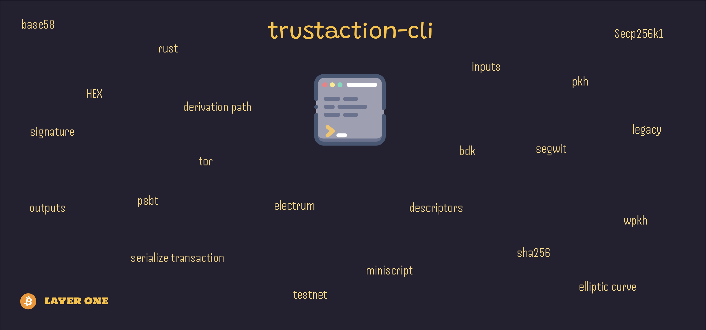

# Overview



These cli scripts are some way to understand deeper `bitcoin` technology and `rust` programming language. To achieve that aim, it uses [bdk library](https://bitcoindevkit.org/)

## Do you want to test it? 

Before execute the commands, first we need to define in which environment we want to run the service. For that, make a copy of `.env-sample` file and renamed as `.env`

## Commands

```rust
cargo run
cargo test
// With output
cargo test -- --nocapture
```